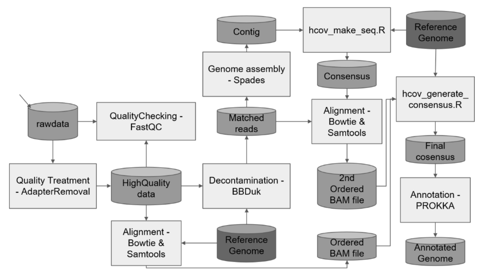

# PiPeCOV
This project proposes to contribute to fill the knowledge gap about Covid-19SARS-CoV-2 in Brazil and with the global knowledge about the pathogen. 

The scientific community and governments of other countries are looking for actions along these lines. The United Kingdom recently established a research network for genomic studies of SARS-CoV-2Covid-19 with a contribution of GBP 20 million (https://www.gov.uk/government/news/uk-launches-whole- genome-sequence-alliance-to-map-spread-of-coronavirus).

The PiPeCOV pipeline can handle quality treatment, assembly and annotation of SARS-CoV-2 genomes sequenced by Illumina (Amplicon & mNGS). Once running PiPeCOV you obtain the assembled and annotated SARS-CoV-2 genomes at the end of the procedure.

The PiPeCOV workflow:

All the steps and commands used in the pipeline for Quality Treatment and Mapping, Assembly and Annotation of the SARS-CoV-2 Genomes are encapsulated in images and Dockers containers. The user just needs to have Docker installed on his machine, without worrying about installing all the tools used in the pipelines.

The docker images used in the pipeline can be found at (https://hub.docker.com/u/itvds)

PiPeCOV must be downloaded from this repo (https://github.com/alvesrco/covid19_itvds)

All Dockerfiles, and pipes repo are developped by the Covid19 Project Network @ ITVDS.
